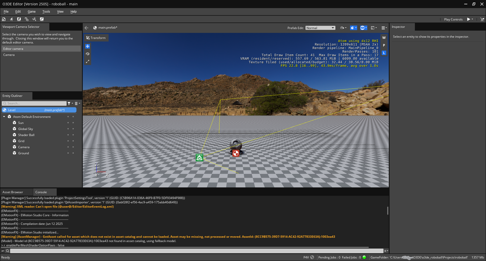

# Roboball tutorial 1

This tutorial is made with the following hardware and environments:
* Windows 11 home
* Lenovo Legion S7 laptop
* Nvidia GTX 3060 (8 gb ram)
* 24 Gb RAM

This tutorial is made for **O3DE version 25.05**, so any version that doesn't match is done at own risk.

## Getting started

If this is your first time working with O3DE make sure that you go through the following tutorials first:

* Getting started: https://www.docs.o3de.org/docs/welcome-guide/
* Editor tour: https://www.docs.o3de.org/docs/welcome-guide/tours/editor-tour/

Then do the following:
*  Create a project called "RoboBall", based on the default Project template ([O3DE tutorial on creating projects](https://www.docs.o3de.org/docs/welcome-guide/create/))
* Build the project and open up the editor of the project
* On the welcome screen a level, select Open... and navigate to Levels\DefaultLevel and select DefaultLevel.prefab.

You should be able to see the following level now:

## Create a ball asset

First select the shader ball and hide it from the entity editor

Then do the following:

* On the scene or Entity editor, do `Ctrl + right mouseclick` and select Create Entity or `Ctrl+Alt+N`
* Select the newly created entity and rename it to 'RoboBall' in the inspector

