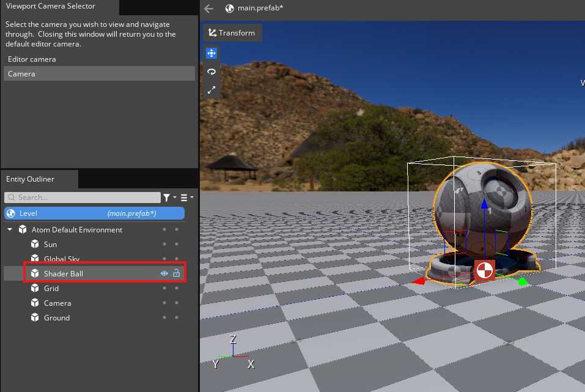

# RoboBall Tutorial 1

This tutorial is made with the following hardware and environments:
* Windows 11 Home
* Lenovo Legion S7 laptop
* Nvidia GTX 3060 (8 GB RAM)
* 24 GB RAM

This tutorial is made for **O3DE version 25.05**, so any version that doesn't match is done at your own risk.

## Getting Started

If this is your first time working with O3DE, make sure that you go through the following tutorials first:

* Getting started: https://www.docs.o3de.org/docs/welcome-guide/
* Editor tour: https://www.docs.o3de.org/docs/welcome-guide/tours/editor-tour/

Then do the following:
* Create a project called "RoboBall", based on the default Project template ([O3DE tutorial on creating projects](https://www.docs.o3de.org/docs/welcome-guide/create/))
* Build the project and open up the editor of the project
* On the welcome screen, select **Open...** and navigate to `Levels\DefaultLevel` and select `DefaultLevel.prefab`

You should be able to see the following level now:

> This can take up to 10-20 minutes to completely finish and for all the assets to be processed. Make sure to wait until the bottom right says `Pending Jobs: 0` and there are no failed builds/jobs.

## Create a Ball Asset

First, select the shader ball and delete it from the Entity Outliner (right-click on it and select **Delete**).

Then create a new entity called RoboBall:

1. On the scene or Entity Outliner, do a right mouse click and select **Create Entity** or press `Ctrl+Alt+N`
1. Select the newly created entity and rename it to `RoboBall` in the Inspector

Then let's add a sphere:

1. Click **Add Component**
1. Add a **Mesh** component
1. Next to **Model Asset**, click on the folder icon and navigate to `PrimitiveAssets > Assets > Objects > _Primitives > _Sphere_1x1.fbx`

You should now see this. As you can notice, the ball is within the floor, so let's move it up.

1. Open up the **Transform** component 
1. Add `0.5` meters in the Z-axis

The viewport should now show this:

Yay! You have a ball! Go to [Part 2](roboball_tutorial_2.md).