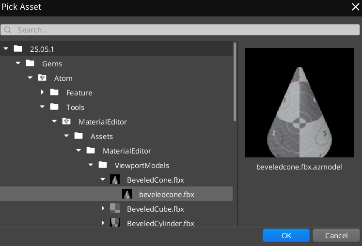
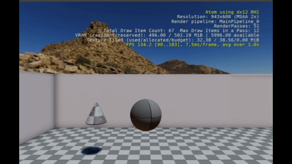

# RoboBall Tutorial 10

And we are at the final part! Let's finally get this thing being autonomous!

As you remember, this was the result in the previous tutorial:


## Differentiate Between Wall and Floor

Let's create some walls! 

Make 1 entity of the box for a wall:

1. In the Entity Outliner, do a right-click and select **Create New Entity**
2. Call the entity `Wall 1` and add a **Mesh Component**
3. Select the box asset as shown in the picture below


4. Add a `PhysX Primitive Collider` and a `PhysX Static Rigid Body`
5. In Transform, in Translate enter `10, 0, 2` meters for X, Y, Z respectively
6. Select **Add Non-Uniform Scale** and enter `1, 20, 4` meters in X, Y, Z respectively


Play the game and you'll see the ball constantly hitting the wall.

Now add the following to the else statement of the collision script:

```lua
	else
		Debug.Log('obstacle')
```

You see now that it constantly hits the wall and detects it since it's different from the floor. You should now see this:


It will keep hitting the obstacle as it doesn't know better. Let's make it even more autonomous.

## Move Away from Obstacles

Now we'll make the ball move away from obstacles.

Add the following property:

```lua
		AvoidAngle = 2.4,
``` 

Replace this line in the obstacle else statement:

```lua
		Debug.Log('obstacle')
```

With:

```lua
		self.ControlHeading = WrapAngle(self.ControlHeading + self.Properties.AvoidAngle)
```

Now let's copy Wall 1 to create Wall 2, 3, and 4. Use these transforms:

* Wall 1: Translate `10, 0, 2` - Rotate `0, 0, 0`
* Wall 2: Translate `-10, 0, 2` - Rotate `0, 0, 0`
* Wall 3: Translate `0, 10, 2` - Rotate `0, 0, 90`
* Wall 4: Translate `0, -10, 2` - Rotate `0, 0, 90`

Make the Wall entities children of an empty entity called `Arena`.

It should look like this in the viewport:


Now run the game and you'll see the ball bouncing away from the walls.


## Move Towards a Goal

The ball is now moving around without any second thought. All it does is avoid obstacles. Let's give it a specific goal to go towards!

Make a new entity and call it `Goal`.

Set it up the same way as with the walls, except select the beveled cone asset (`Gems/Atom/Tools/MaterialEditor/assets/MaterialEditor/ViewportModels/BeveledCone.fbx`). Don't forget to also add the PhysX Primitive Collider component as a static object. 



Translate the object to `5, 5, 1.5` meters respectively in the Transform component. 

Open up the `RoboBall_Autonomous.lua` script and add the following EntityID field to properties:

```lua
		GoalId = EntityId(),
```

And then in `OnCollisionBegin()`, add the following to the start of the function:

```lua
	local GoalVector = TransformBus.Event.GetWorldTranslation(self.Properties.GoalId);
	local BallPos = TransformBus.Event.GetWorldTranslation(self.entityId); 
	local ToGoalVector = GoalVector - BallPos;

	local goalHeading = math.atan(ToGoalVector.y, ToGoalVector.x);
	self.ControlHeading = goalHeading;
```

You can remove the else part of the if statement now since the control heading will get overwritten anyway:

```lua
	--else
	--	self.ControlHeading = WrapAngle(self.ControlHeading + self.Properties.AvoidAngle)
```

Play the game and you should see this:



## Respawn the Goal

Add a Lua Script component to the Goal. Then make a script called `Goal_Respawn.lua` and copy this content into it:

```lua
local GoalRespawn = {
	Properties = {
		AreaSize = 18.0,
	}
}

function GoalRespawn:OnActivate()
	self.RigidBodyNotificationBusHandler = RigidBodyNotificationBus.Connect(self, self.entityId)
end

function GoalRespawn:OnPhysicsEnabled(entityId)
	local event = SimulatedBody.GetOnCollisionBeginEvent(self.entityId);
	self.CollisionEvent = event:Connect(
		function(_, collision)
			self:OnCollisionBegin(collision)
		end
	);
end

function GoalRespawn:OnCollisionBegin(collision)
	Debug.Log('Goal hit! Respawning...')
	
	local halfSize = self.Properties.AreaSize / 2;
	local randomX = (math.random() - 0.5) * self.Properties.AreaSize; 
	local randomY = (math.random() - 0.5) * self.Properties.AreaSize; 
	local currentPos = TransformBus.Event.GetWorldTranslation(self.entityId);
	local newPos = Vector3(randomX, randomY, currentPos.z);
	TransformBus.Event.SetWorldTranslation(self.entityId, newPos);
	
	Debug.Log('Goal moved to: ' .. tostring(newPos.x) .. ', ' .. tostring(newPos.y))
end

function GoalRespawn:OnDeactivate()
	self.RigidBodyNotificationBusHandler:Disconnect()
	self.CollisionEvent:Disconnect()
end

return GoalRespawn
```

This will make the goal respawn whenever the ball hits it to a random location in the arena!

## Last Improvements to the Autonomy Script

If you play the game, you can see that the RoboBall quickly gets stuck in local minima trying to hit the goal, so let's add some randomness to its goal detection.

Replace:

```lua
	self.ControlHeading = goalHeading;
```

With:

```lua
	local random_heading = (math.random() - 0.5) 
	self.ControlHeading = goalHeading - random_heading;
```

The total script should look like this now:

```lua
local Autonomous = {
	Properties = {
		ForwardRef = 6.0,
		BounceRef = 6.0,
		RotationDiff = 0.2,
		InputEventName = "Control",
		AngularVelocity = 0.2,
		GroundId = EntityId(),
		AvoidAngle = 2.4,
		GoalId = EntityId(),
	}
}

function WrapAngle(angle)
    return (angle + math.pi) % (2 * math.pi) - math.pi
end

function Autonomous:OnActivate()
	local inputBusId = InputEventNotificationId(self.Properties.InputEventName)
	self.InputNotificationBus = InputEventNotificationBus.Connect(self, inputBusId)
	self.RigidBodyNotificationBusHandler = RigidBodyNotificationBus.Connect(self, self.entityId)
	self.first_run = false
	self.ControlHeading = 0.0
end

function Autonomous:OnPhysicsEnabled(entityId)
	local event = SimulatedBody.GetOnCollisionBeginEvent(self.entityId);
	self.CollisionEvent = event:Connect(
		function(_, collision)
			self:OnCollisionBegin(collision)
		end
	);
end

function Autonomous:OnCollisionBegin(collision)
	local GoalVector = TransformBus.Event.GetWorldTranslation(self.Properties.GoalId);
	local BallPos = TransformBus.Event.GetWorldTranslation(self.entityId); 
	local ToGoalVector = GoalVector - BallPos;

	local goalHeading = math.atan(ToGoalVector.y, ToGoalVector.x);
	local random_heading = (math.random() - 0.5) 
	self.ControlHeading = goalHeading - random_heading;

	if collision:GetBody2EntityId() == self.Properties.GroundId then
		local velocity = RigidBodyRequestBus.Event.GetLinearVelocity(self.entityId);
		local mass = RigidBodyRequestBus.Event.GetMass(self.entityId);
		local BounceImpulse = mass * (self.Properties.BounceRef - velocity.z)
		
		local ForwardVelocity = velocity.x * math.cos(self.ControlHeading) + velocity.y * math.sin(self.ControlHeading);
		local ForwardImpulse = mass * (self.Properties.ForwardRef - ForwardVelocity)
		local x_new = ForwardImpulse * math.cos(self.ControlHeading)
		local y_new = ForwardImpulse * math.sin(self.ControlHeading)
		RigidBodyRequestBus.Event.ApplyLinearImpulse(self.entityId, Vector3(x_new, y_new, BounceImpulse));
	end
end

function Autonomous:OnPressed(value)
	self.ControlHeading = WrapAngle(self.ControlHeading + value * self.Properties.AngularVelocity)
end

function Autonomous:OnDeactivate()
	self.InputNotificationBus:Disconnect();
	self.RigidBodyNotificationBusHandler:Disconnect()
end

return Autonomous
```

Now you should be able to see this when you play the game! 


The control is not perfect, but it is not meant to be. It's a chance for you to improve the control, add some obstacles (I recommend the white box collider), and perhaps add some learning. 

## The End

That is it! Hopefully you have learned enough of the basic mechanics of O3DE to make your own autonomous agents. Have fun!