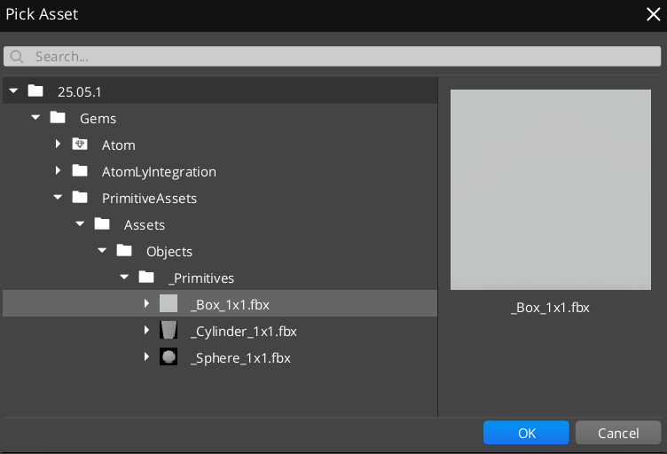
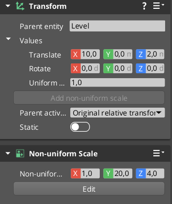
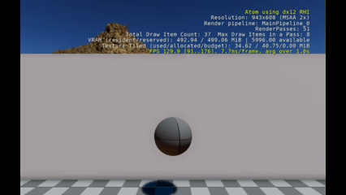
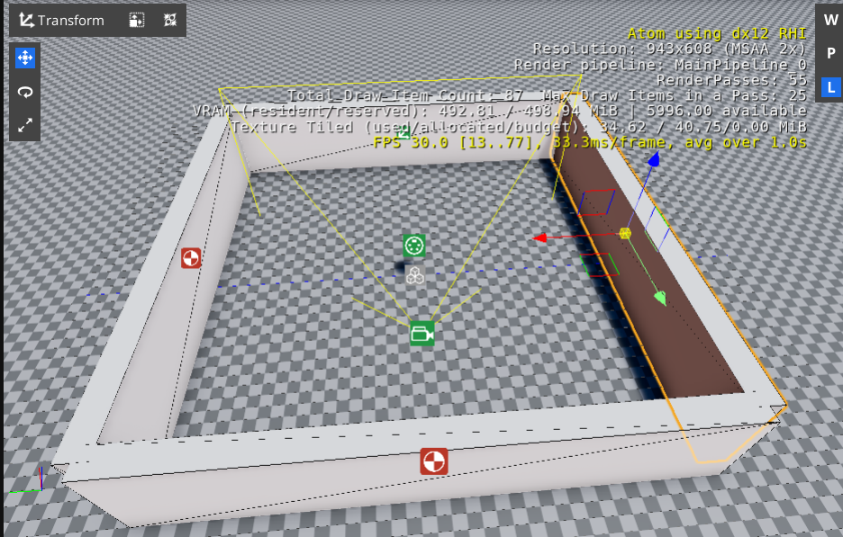
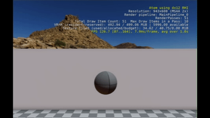

# Roboball 10

and we are at the final part! let's finally get this thing being autonomous!

As you remmembered, this was the result in the pervious tutorial:


## Differentiate between wall and floor

Let's create some walls! 

Make 1 entity of the box for a wall. 
1. In the entitiy outliner, do a right click and select 'Create new entity'. 
2. Call the entity Wall 1 and add a Mesh Component
3. Select the box asset as according to the below picture



4. Add a  `PhysX Primitive Collider` and a `Static Rigid Body`
5. In transform, in transalte enter 10, 0, 2 meters for x,y,z respectively
6. Select add non-uniform scale and enter 1, 20, 4 meters in x,y,z respecively




Play the game and you'll see the ball constantly hitting the wall 

Now at the following to the ifstatement of the collision script

```lua
	else
		Debug.Log('obstacle')
```

You see now that it constantly hits the wall and detects is since it's different from the floor. You should now see this:



It will keep hitting the obstacle as it doesn't know better. Let's make it even more autonomous.

## Move away  from obstacles

Now we move away from the obstacles.

Add the following property:
```lua
		AvoidAngle = 2.4,
``` 

Add this line to the obstacle if statement

replace
```lua
		Debug.Log('obstacle')

```
with 

```lua
		self.ControlHeading = WrapAngle(self.ControlHeading + self.Properties.AvoidAngle )
```

Now let's copy Wall 1, to create Wall 2, 3 and 4. Use these transforms:

* Wall 1: translate 10, 0, 2 - Rotate 0, 0, 0
* Wall 2: translate -10, 0, 2 - Rotate 0, 0, 0
* Wall 3: translate 0, 10, 2 - Rotate 0, 0, 90
* Wall 4: translate 0, -10, 2 - Rotate 0, 0, 90

Make the Wall entities childern of an empty entity called Arena

It should look like this in the viewport:



Now run the game and you'll see the ball bouncing away from the walls.




## Move towards a goal

The ball is now moving around without any second thought. All it does is to avoid obstacles. Let's give a specific goal to go towards!


Seems we were a bit too soon with removing ontick. Let's add that back

Add back in onactivate

```lua
	self.TickNotificationBus = TickBus.Connect(self);

```

and on deactivate:
```lua

	self.TickNotificationBus:Disconnect();
```

and this following function:

```lua
function Autonomous:OnTick(deltaTime, currentTime)
	local GoalVector = Vector3(-5, -5, 0)
	local BallPos = TransformBus.Event.GetWorldTranslation(self.entityId); 
	local ToGoalVector = GoalVector - BallPos;
	local goalHeading = math.atan(ToGoalVector.y, ToGoalVector.x);
	self.ControlHeading = goalHeading;
end
```
Then add a cone with a primitive static colider to that same location.

Now the ball will contstantly try to go to that place.