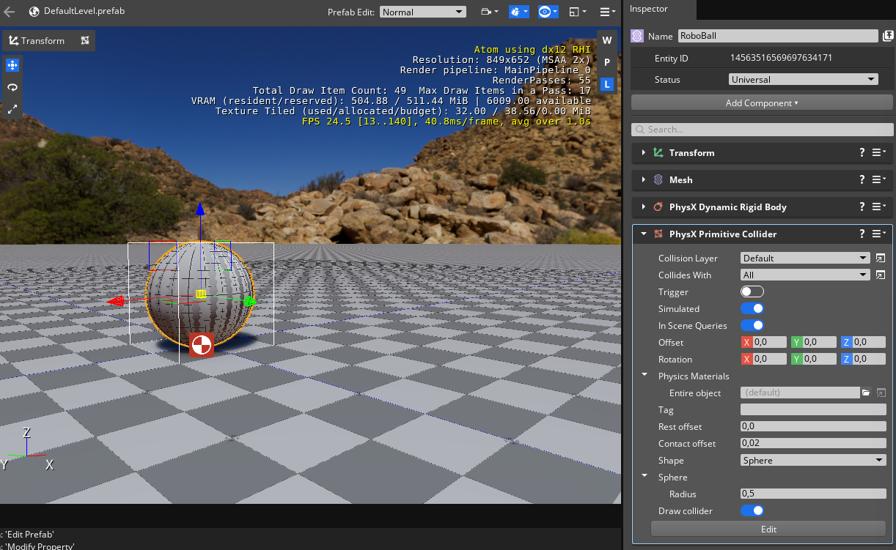
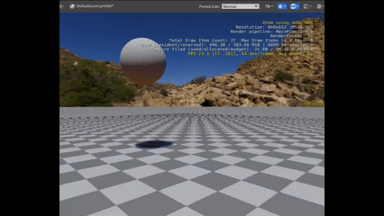
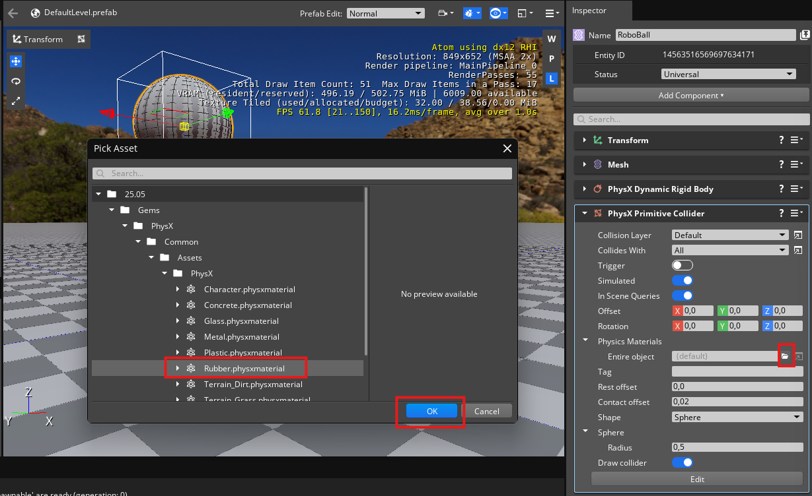

# Roboball tutorial 2

This page is a continuation of [page 1](roboball_tutorial_1.md), which should have resulted in the following ball assest and level:

If you don't, do tutorial 1 again or open the project from Projects>Roboball_1 of this repository.

## Add Physics Component

Let's add some physics to the ball! 

1. Select the Roboball Entity
1. Add a `Physix Primitive Collider component`
1. You see a warning that a required component is missing. 
1. Click `Add Required Component`
1. Add a `Physix Dynamic Rigid Body`

It should now look like this:

## Collider

The gray box around the entity is the shape of the collider, which is default a size of a cube. Let's change that to a sphere:

1. In the `Physics Primitive Collider` component
1. Select `Sphere`
1. Leave radius at `0,5`

It should now look like this in the viewport

Let's test it out! First, let's place the ball a bit higher:

1. Go to transform and put Z to `2,0 M`
1. Play the game by the play button on the top right or type `ctrl + G`

It drops with a bounce now! 

> Try disabling the Physicx component and do the same, and you see the ball staying in the air.

## Add a different material

We want to have a constant bounce with this ball, so that it bounces around like a skippy ball. We've got to adjust the material for that.

1. Go to the `Physics Primitive Collider` commponent
1. Select the folder icon next to `Physics Materials > Entire Object`
1. Go to `PhysX > Common > Assets > PhysX` and select `Rubber.physxmaterial`
1. Press OK

