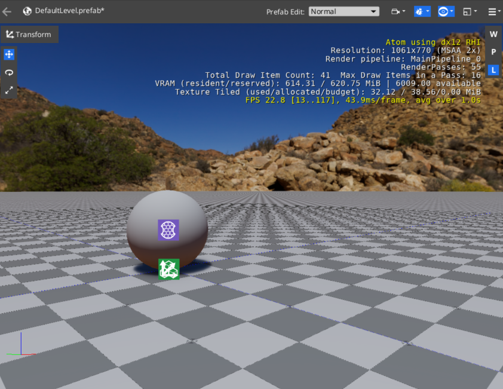
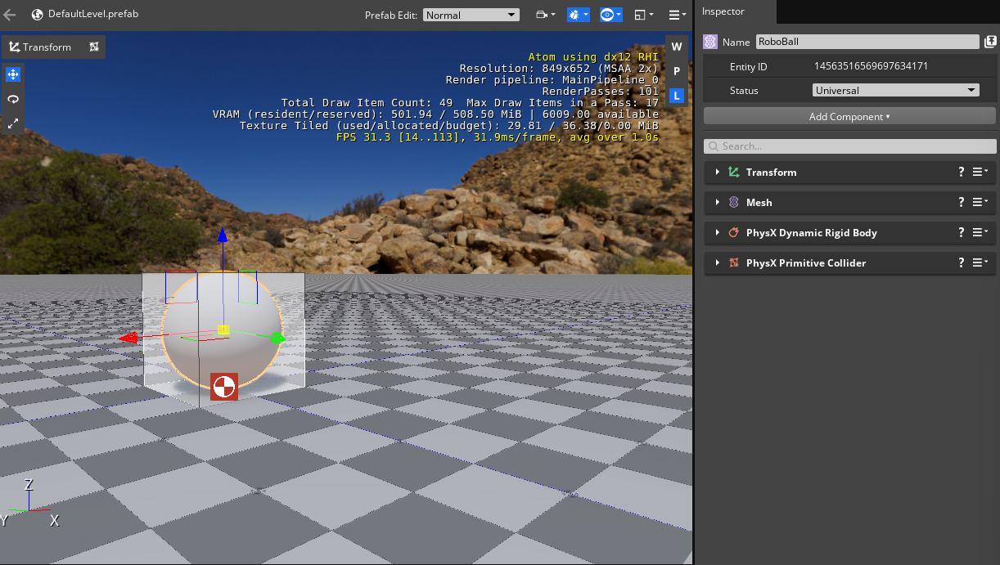

# Roboball tutorial 2

This page is a continuation of [page 1](roboball_tutorial_1.md), which should have resulted in the following ball assest and level:

If you don't, do tutorial 1 again or open the project from Projects>Roboball_1 of this repository.

## Add Physics

Let's add some physics to the ball! 

1. Select the Roboball Entity
1. Add a Physix Primitive Collider component
1. You see a warning that a required component is missing. 
1. Click `Add Required Component`
1. Add a Physics Dynamic Rigid Body

It should now look like this:

