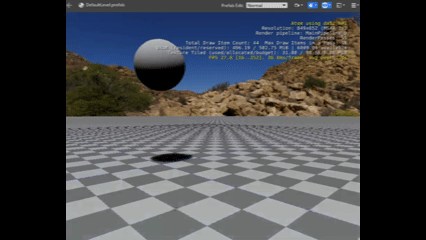
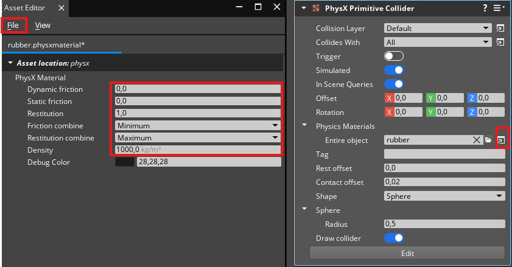
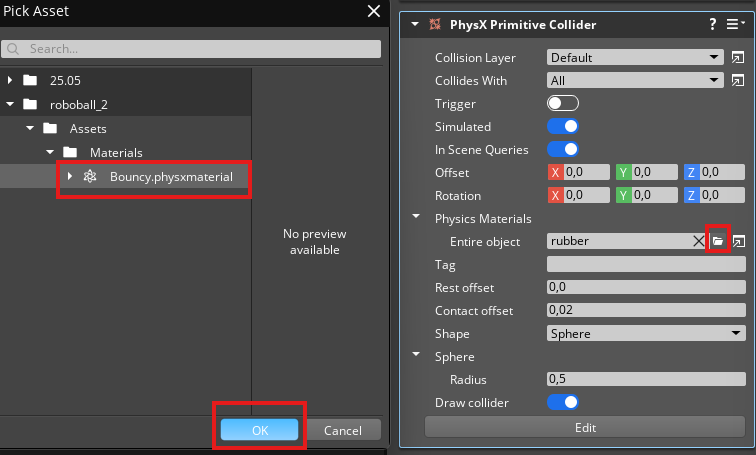

# RoboBall Tutorial 2

This page is a continuation of [Part 1](roboball_tutorial_1.md), which should have resulted in the following ball asset and level:

If you don't have this, do Tutorial 1 again or open the project from `Projects > Roboball_1` of this repository.

## Add Physics Component

Let's add some physics to the ball! 

1. Select the RoboBall entity
1. Add a `PhysX Primitive Collider` component
1. You see a warning that a required component is missing
1. Click **Add Required Component**
1. Add a `PhysX Dynamic Rigid Body`

It should now look like this:

## Collider

The gray box around the entity is the shape of the collider, which by default is the size of a cube. Let's change that to a sphere:

1. In the `PhysX Primitive Collider` component
1. Select `Sphere`
1. Leave radius at `0.5`

It should now look like this in the viewport:

Let's test it out! First, let's place the ball a bit higher:

1. Go to **Transform** and set Z to `2.0 M`
1. Play the game by clicking the play button on the top right or press `Ctrl+G`

It drops with a bounce now! 

> Try disabling the PhysX component and do the same, and you'll see the ball staying in the air.

## Add a Different Material

We want to have a constant bounce with this ball, so that it bounces around like a skippy ball. We've got to adjust the material for that.

1. Go to the `PhysX Primitive Collider` component
1. Select the folder icon next to `Physics Materials > Entire Object`
1. Go to `PhysX > Common > Assets > PhysX` and select `Rubber.physxmaterial`
1. Press **OK**

Now press the play button. You'll notice that there is a slightly bigger bounce!

## More Bounce!

This is getting in the right direction, but we want a ridiculous amount of bounce! Let's edit this material to achieve that!

1. Open up the Asset Editor, which is next to the folder icon next to `Physics Materials > Entire Object`
1. Change the material properties to:
    * Dynamic Friction: `0.0`
    * Static Friction: `0.0`
    * Restitution: `1.0`
    * Friction Combine: `Minimum`
    * Restitution Combine: `Maximum`
    * Density: `1000.0 kg/m^3`
1. Go to `File > Save as...`
1. Go to the Assets folder of your project
1. Create a new folder called `Materials`
1. Save the material in that folder and call it `Bouncy`

Close the Asset Editor and let's add the new material:

1. Click the folder icon next to `Physics Materials > Entire Object`
1. Navigate to your project and go to `Assets > Materials` 
1. Select `Bouncy.physxmaterial`
1. Press **OK**

Now when you press play you should see this:

We now have a bouncy ball!

Go to [Part 3 of the RoboBall tutorial](roboball_tutorial_3.md).