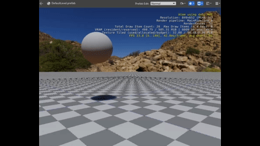
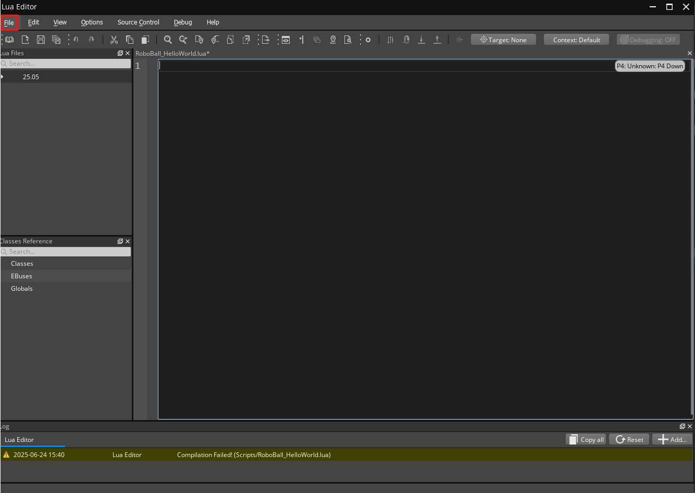
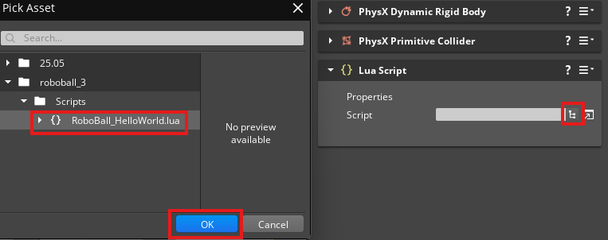

# RoboBall Tutorial 3

If you completed [Part 2 of the RoboBall tutorial](roboball_tutorial_2.md), you should have a bouncy ball like this. If not, please complete it first or start with the project in `/Projects/roboball_2`. 



## Add a Lua Script

So the ball bounces away and that's nice, but that gets boring after a while. Let's give it a Lua script for more complex behavior.


1. Select the RoboBall entity
1. Click **Add Component**
1. Select **Lua Script**
1. Open the Lua editor with the symbol next to the empty field



Let's make a simple Lua script:

1. Go to `File > New`
1. Make a new folder called `Scripts`
1. In that folder, call the file `RoboBall_HelloWorld.lua`
1. Go back to the editor
1. In the Lua Script component, let's add this Lua script



## Hello World!

Now back in the Lua Editor in the `RoboBall_HelloWorld.lua`, enter the following:

```lua
local HelloWorld = {
	Properties = {
	}
}

function HelloWorld:OnActivate()
	Debug.Log("Hello, World!")
end

function HelloWorld:OnTick(deltaTime, currentTime)
end

function HelloWorld:OnDeactivate()
	Debug.Log("Goodbye, World!")
end

return HelloWorld
```

The console in the O3DE editor should now say:

```
Entered game mode
(Script) - Hello, World!
(Spawnables) - Entities from new root spawnable 'Root.spawnable' are ready (generation: 0).
(Script) - Goodbye, World!
Exited game mode
```

So `OnActivate()` is started when the game is activated, and `OnDeactivate()` is activated when the game is ended (when you press `Esc`).

## Hello, Again!

Now I'd like the ball to talk to me all the time! So let's add a tick notification bus to it.

Connect to the tick notification bus in `OnActivate()`:

```lua
	self.TickNotificationBus = TickBus.Connect(self);
```

Add a new function `OnTick()`:

```lua
function HelloWorld:OnTick(deltaTime, currentTime)
 	Debug.Log("Hello again!")
end
```

And disconnect from the bus when the game ends in `OnDeactivate()`:

```lua
	self.TickNotificationBus:Disconnect();
```

The full script should look like this:

```lua
local HelloWorld = {
	Properties = {
	}
}

function HelloWorld:OnActivate()
	Debug.Log("Hello, World!")
	self.TickNotificationBus = TickBus.Connect(self);
end

function HelloWorld:OnTick(deltaTime, currentTime)
 	Debug.Log("Hello again!")
end

function HelloWorld:OnDeactivate()
	Debug.Log("Goodbye, World!")
	self.TickNotificationBus:Disconnect();
end

return HelloWorld
```

When running the game you should see this in the console:

```
Entered game mode
(Script) - Hello, World!
(Spawnables) - Entities from new root spawnable 'Root.spawnable' are ready (generation: 0).
(Script) - Hello again!
(Script) - Hello again!
(Script) - Hello again!
(Script) - Hello again!
...
(Script) - Hello again!
(Script) - Hello again!
(Script) - Hello again!
(Script) - Hello again!
(Script) - Goodbye, World!
Exited game mode
```

## Go to the Next Part

You've added a Lua script! Let's go to [Part 4](roboball_tutorial_4.md) to do something with the physics in that script.