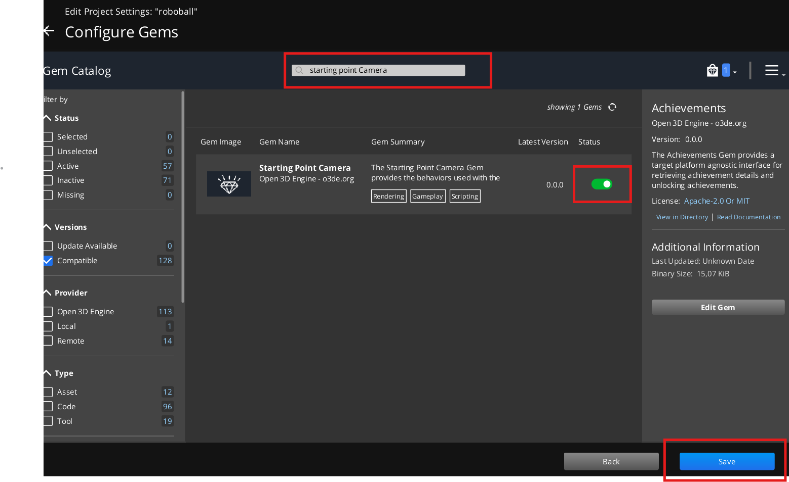
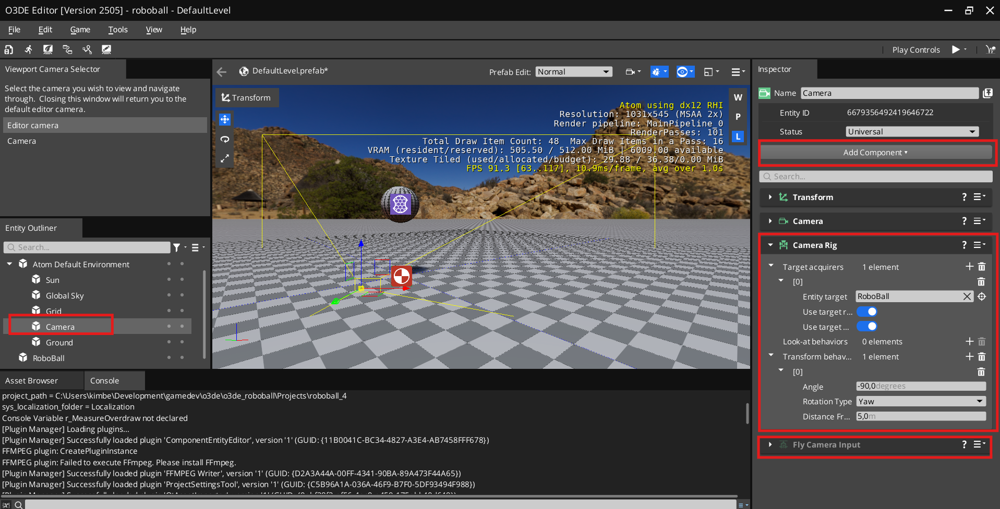

# RoboBall Tutorial 4

> If you completed [Part 3 of the RoboBall tutorial](roboball_tutorial_3.md), you should have a Hello World Lua script example with the bouncy ball from Part 1. If not, please complete it first or start with the project in `/Projects/roboball_3`. 

Let's add some capabilities to the ball by using the Lua script, and add a Camera Rig to follow the ball more closely.

## Add a Linear Impulse


Let's open up the Lua editor again and create a new script:

1. Open the Lua editor with the symbol next to the empty field
1. Go to `File > New`
1. Call it `RoboBall_Movement.lua`
1. Go back to the editor
1. In the Lua Script component, add this Lua script we just made

Now enter the following in the script (similar to the previous section):

```lua
local Movement = {
	Properties = {
	}
}

function Movement:OnActivate()
	self.TickNotificationBus = TickBus.Connect(self);
end

function Movement:OnTick(deltaTime, currentTime)
end

function Movement:OnDeactivate()
	self.TickNotificationBus:Disconnect();
end

return Movement
```

Now add a linear impulse at each tick of the game:

```lua
function Movement:OnTick(deltaTime, currentTime)
    RigidBodyRequestBus.Event.ApplyLinearImpulse(self.entityId, Vector3(0, 1, 0));
end
```

Now play the game and observe it slowly going forward.


## Add a Property

That goes a bit too slow, so let's fine-tune it a bit. For that we need to add a property to the Lua script.

Add the following to properties:

```lua
	Properties = {
		ImpulseSize = 1.0,
	} 
```

And add the ImpulseSize property to LinearImpulse:

```lua
	RigidBodyRequestBus.Event.ApplyLinearImpulse(self.entityId, Vector3(self.Properties.ImpulseSize, 0.0, 0.0));
```

Save the script and see the following appear in the Lua Script component:


Change that value to `10.0` and run the game again.


The ball is going forward much faster... a bit too fast perhaps?!

## Add a Camera Rig

The ball is bouncing away too quickly and out of our view... but currently you'll need to manually follow it, which is a bit of a pain. So, let's add a Camera Rig to the Camera entity.

But for this to work, we need the Starting Point Camera Gem enabled for the project.


Then look for the 'Starting Point Camera' Gem:



1. In the search bar, look for `Starting Point Camera`
1. Toggle to **Activate**
1. Press **OK** on the bottom

You'll get a warning that you'll need to rebuild your project, and that is exactly what you need to do! 

1. Rebuild the RoboBall project
1. Wait for a few minutes
1. Reopen the project once finished



Then add the Camera Rig component:

1. Select the **Camera** entity in **Atom Default Environment** in the Entity Outliner
1. Disable the `Fly Camera Input` component
1. Add the `Camera Rig` component
1. Next to **Target Acquirers**, press the `+` button
1. Add the `AcquiresByEntityID` class
1. Drag the RoboBall entity into the `Entity Target` field
1. At **Target Behaviors**, press the `+` button
1. Add the `FollowTargetFromAngle` class and input the following:
    * Angle: `-90`
    * Rotation type: `yaw`
    * Distance from Target: `5`

> The Camera Rig component documentation has more information if you want to know more: https://docs.o3de.org/docs/user-guide/components/reference/camera/camera-rig/


Now the camera will follow the ball! You can continue to [Part 5](roboball_tutorial_5.md).