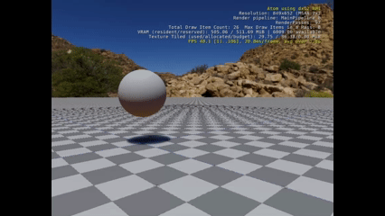
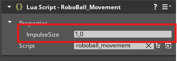
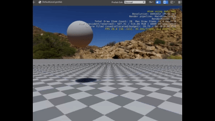

# Roboball Tutorial 4


> If you completed [part 3 of the roboball tutorial](roboball_tutorial_3.md) of the tutorial, you should be able to have an hello_world lua script example with the bouncy ball of part 1. If not, please complete it first or start with the project in /Projects/roboball_3. 

Let's add some capabilities to the ball by using the Lua script, and to add an Camera rig to follow the ball more closely.

## Add a linear impulse


Let's open up the Lua editor again and create a new script

1. Open the Lua editor with the symbol next to the empty field
1. Go to File > New
1. call it `RoboBall_Movement.lua`
1. Go back to the editor
1. In the Lua script component add this Lua script we just made.

Now enter the following in the script (similar to the previous section)

```lua
local Movement = {
	Properties = {
	}
}

function Movement:OnActivate()
	self.TickNotificationBus = TickBus.Connect(self);
end

function Movement:OnTick(deltaTime, currentTime)
end

function Movement:OnDeactivate()
	self.TickNotificationBus:Disconnect();
end

return Movement
```

Now add a linear impulse at each tick of the game:

```lua
function Movement:OnTick(deltaTime, currentTime)
    RigidBodyRequestBus.Event.ApplyLinearImpulse(self.entityId, Vector3(0, 1, 0));
end
```

Now play the game and observe it slowely going forward.



## Add a property

That goes a bit too slow, so let's fine tune it a bit. For that we need to add a property to the Lua script.

Add the following to properties:

```lua
...
	Properties = {
		ImpulseSize = 1.0,
	} 
...
```

And add the ImpulseSize property to LinearImpulse

```lua
...
	RigidBodyRequestBus.Event.ApplyLinearImpulse(self.entityId, Vector3(self.Properties.ImpulseSize, 0.0, 0.0));
...
```

Save the script and see the following appear in the Lua Script component:



Change that value to `10.0` and run the game again.



The ball is going forward must faster... a bit too fast perhaps?!
