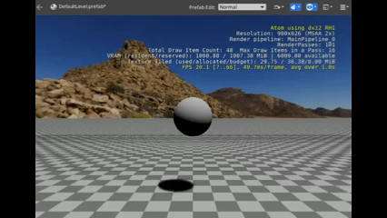
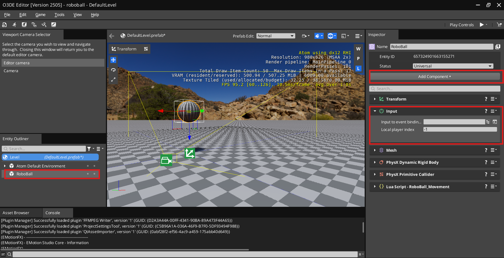
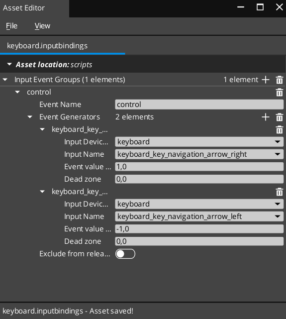
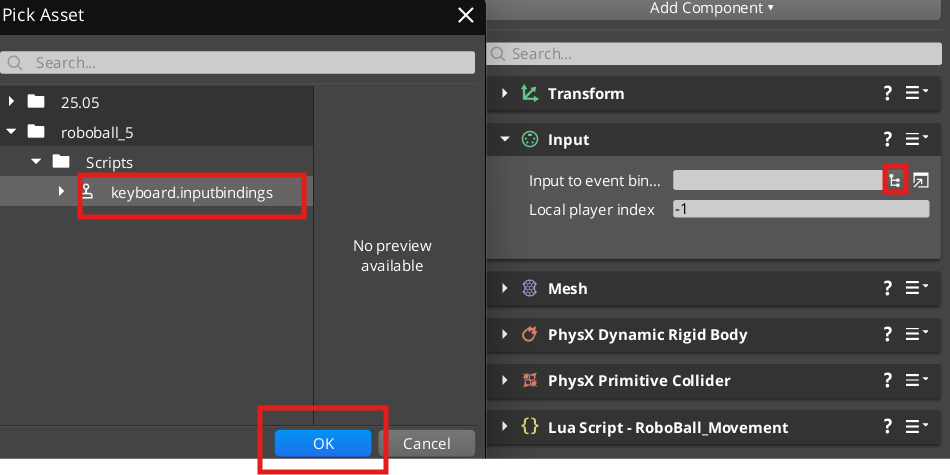
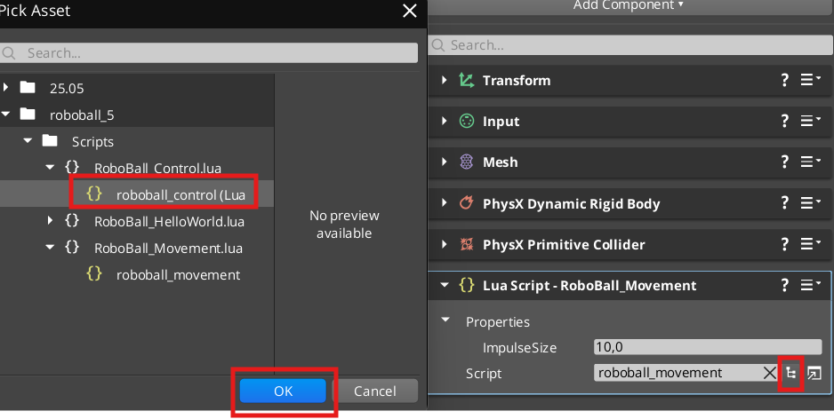

# Roboball Tutorial 5


In [Roboball tutorial part 4](roboball_tutorial_4.md) you should have a forward bouncing ball with a camera rig like this:



If not, please complete it first or start with the project in /Projects/roboball_4. 

In this tutorial, we will add keybindings to the project and read/react to them in the Lua script


## Make keyboard input bindings

Here we will show how to make keyboard ba



1. Select the `RoboBall` entity and go to the Inspector
1. Click on add component and add the `Input` componenent 
1. Click on the Open Assest Editor next to the `Input to Event Bindings`



1. Go to File > New > Inputbindings or Save as ... (if there is already one generated)
1. Go to Scripts and save it as `keyboard.inputbindings`
1. Call the eventname `Control`
1. Next to event generators click the `+ button`
1. Add 1 classes of the type `EventInputMap`
1. Put this in the fields:
    * input Device: Keyboard
    * Input Name: keyboard_key_navigation_arrow_right
    * Event Value: -1,0
    * Dead zone: 0,0
1. Add another class of the type `EventInputMap`
1. Put this in the fields:
    * input Device: Keyboard
    * Input Name: keyboard_key_navigation_arrow_left
    * Event Value: 1,0
    * Dead zone: 0,0
1. Save the input binding




Then let's add the keybindings to the input component

1. Push the folder button next to the `Input to Event Bindings` field
1. Navigate to `roboball > Scripts`
1. Select `keyboard.inputbindings` and press `OK`

You should now see keyboard in the input component.

## Add Event bus to Lua script

Open up the Lua editor and start a new script called 'RoboBall_Control.Lua'. Input the following:

```lua
local Control = {
	Properties = {
		ImpulseSize = 1.0,
	}
}

function Control:OnActivate()
	self.TickNotificationBus = TickBus.Connect(self);
end

function Control:OnTick(deltaTime, currentTime)
	RigidBodyRequestBus.Event.ApplyLinearImpulse(self.entityId, Vector3(self.Properties.ImpulseSize, 0.0, 0.0));
end

function Control:OnDeactivate()
	self.TickNotificationBus:Disconnect();
end

return Control
```
Add the new script to the Lua Script component:



Now add the following to properties:

```lua
		InputEventName = ""
```

And these two lines to OnActivate():

```lua
	local inputBusId = InputEventNotificationId(self.Properties.InputEventName)
	self.InputNotificationBus = InputEventNotificationBus.Connect(self, inputBusId)
```

And the Bus disconnect in OnDisconnect():

```lua
	 self.InputNotificationBus:Disconnect();
```

Now add the function that will react when either of the 2 arrow buttons are being held:

```lua
function Control:OnPressed (value)
 	local ImpulseDirection = value * self.Properties.ImpulseSize
	RigidBodyRequestBus.Event.ApplyLinearImpulse(self.entityId, Vector3(0, ImpulseDirection, 0));
 end
```

Now you should be able to control the ball somewhat with the control keys, which should result in this with ImpulseSize being 5.0.

See the resulting script here:

```lua
local Control = {
	Properties = {
		ImpulseSize = 1.0,
		InputEventName = ""
	}
}

function Control:OnActivate()
	self.TickNotificationBus = TickBus.Connect(self);
end

function Control:OnTick(deltaTime, currentTime)
	RigidBodyRequestBus.Event.ApplyLinearImpulse(self.entityId, Vector3(self.Properties.ImpulseSize, 0.0, 0.0));
	local inputBusId = InputEventNotificationId(self.Properties.InputEventName)
	self.InputNotificationBus = InputEventNotificationBus.Connect(self, inputBusId)
end

function Control:OnPressed (value)
	local ImpulseDirection = value * self.Properties.ImpulseSize
	RigidBodyRequestBus.Event.ApplyLinearImpulse(self.entityId, Vector3(0, ImpulseDirection, 0));
 end


function Control:OnDeactivate()
	self.TickNotificationBus:Disconnect();
	self.InputNotificationBus:Disconnect();

end

return Control
```
Now you can control your ball!


We are not done here yet, so go ahead to part 6! 

