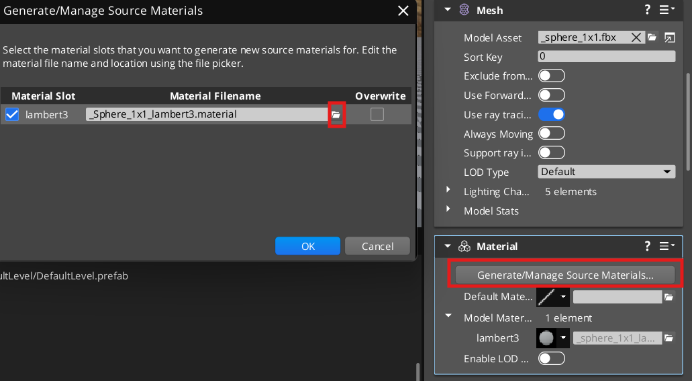
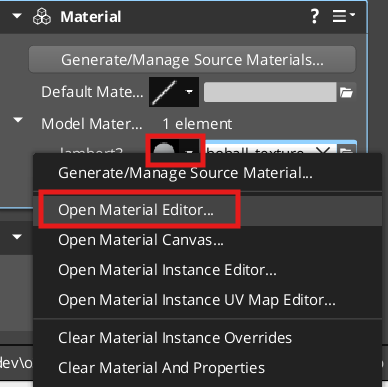
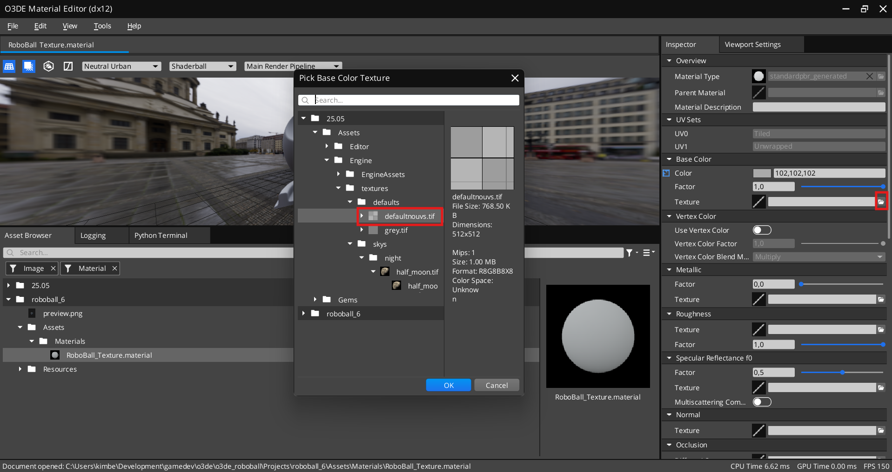
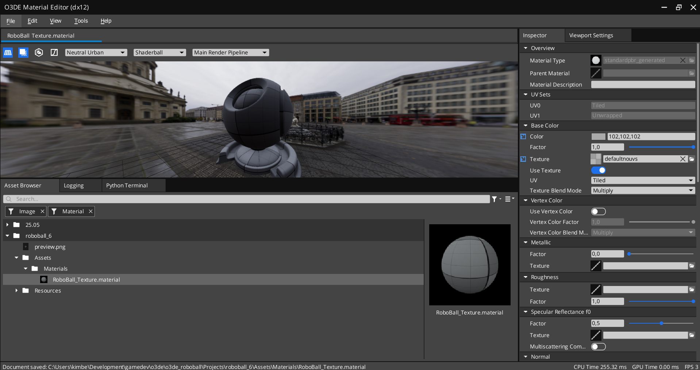
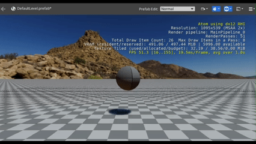
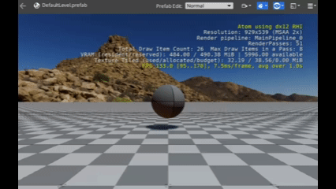

# Roboball 6

In the last section you were able to control the balll to some degree.


.

As you noticed, you could give it a different direction but it wouldn't rotate with the user. Let's change that a bit, but first let's add a texture to the ball.

## Add a texture to the ball

Select the Roboball entity and in the Mesh component, press 'add material component' or add it through 'Add Coponent.



In the material compopnent:
1. Press Geenrate/Mange Source Materials
1. Next to the existing material slot, press the folder symbol
1. Navigate to your projects asset/materials folder and save it as RoboBall_Texture.materials





Now open the material editor 




1. Press on the folder icon next to Model Materials/lambert3
1. Navigate to 25.05/Assets/Engine/Textures/Defaultnouvs.tif
1. Press OK
1. Save the material file



You should be able to see that the material has updated. You can close the editor now.

# Add a rotation

Let's play the game and see what happens



If you move it around, you notice that the ball itself doesn't rotate with. THat doesn't seem very natural. Let's change the behavior a bit so let's dig in the Lua script again.

Select the robotball entity Open up the Lua editor next to roboball_control field.

Comment out the following apply linear impulse and add a apply angularimpulse instead. This time it's using the z asix of the Vector3 since it will need to rotate around yaw

```lua
-- 	RigidBodyRequestBus.Event.ApplyLinearImpulse(self.entityId, Vector3(0, ImpulseDirection, 0));
	RigidBodyRequestBus.Event.ApplyAngularImpulse(self.entityId, Vector3(0.0, 0.0, ImpulseDirection));
```

Play the game again and use the arrow keys so you should see this.

.

Now the rotation of the mesh changes, but this doesn't change the direction of the forward impulse so it will keep going forward. 


