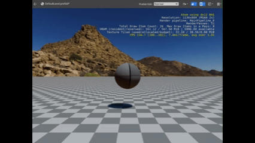

# RoboBall Tutorial 6

In the last section, you were able to control the ball to some degree.


As you noticed, you could give it a different direction but it wouldn't rotate with the user input. Let's change that, but first let's add a texture to the ball.

## Add a Texture to the Ball

Select the RoboBall entity and in the Mesh component, press **Add Material Component** or add it through **Add Component**.


In the Material component:

1. Press **Generate/Manage Source Materials**
1. Next to the existing material slot, press the folder symbol
1. Navigate to your project's `Assets/Materials` folder and save it as `RoboBall_Texture.material`


Now open the Material Editor:


1. Press on the folder icon next to `Model Materials/lambert3`
1. Navigate to `25.05/Assets/Engine/Textures/DefaultNormals.tif`
1. Press **OK**
1. Save the material file


You should be able to see that the material has updated. You can close the editor now.

## Add Rotation

Let's play the game and see what happens:


If you move it around, you notice that the ball itself doesn't rotate. That doesn't seem very natural. Let's change the behavior a bit, so let's dig into the Lua script again.

Select the RoboBall entity and open up the Lua editor next to the `roboball_control` field.

Comment out the following linear impulse and add an angular impulse instead. This time it's using the Z-axis of the Vector3 since it will need to rotate around yaw:

```lua
-- 	RigidBodyRequestBus.Event.ApplyLinearImpulse(self.entityId, Vector3(0, ImpulseDirection, 0));
	RigidBodyRequestBus.Event.ApplyAngularImpulse(self.entityId, Vector3(0.0, 0.0, ImpulseDirection));
```

Play the game again and use the arrow keys. You should see this:


Now the rotation of the mesh changes, but this doesn't change the direction of the forward impulse, so it will keep going forward. 

## Get Entity Orientation

We would like to know where the RoboBall is looking at and apply the linear impulse at that angle. Let's get the orientation in yaw.

Add the following to `OnTick()`:

```lua
local Rot = TransformBus.Event.GetWorldRotation(self.entityId); 
Debug.Log(Rot.z)
```

If you run the simulation now, you should be able to see the yaw orientation in radians in the console.

For more information, go to: https://www.docs.o3de.org/docs/user-guide/components/reference/transform/

## Apply Rotation to Impulse

So I'd like the impulse to be applied to the direction that the ball is currently facing. Let's use this rotation and transform the vector of the impulse to be rotated in the right direction. 

Add this part after the rotation retrieval in the `OnTick()` code:

```lua
	local Rot = TransformBus.Event.GetWorldRotation(self.entityId); 
 	local ImpulseSize = self.Properties.ImpulseSize
 	local x_new = ImpulseSize * math.cos(Rot.z)
 	local y_new = ImpulseSize * math.sin(Rot.z)
	RigidBodyRequestBus.Event.ApplyLinearImpulse(self.entityId, Vector3(x_new, y_new, 0.0));
```

If you play the game again, you see that the linear impulse is at least rotated towards the direction that you want it to go. It's not ideal, but it is something.



You can now go to [Part 7](roboball_tutorial_7.md)!