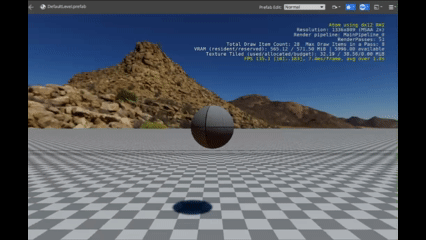
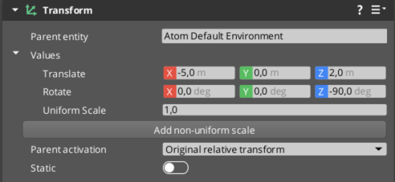
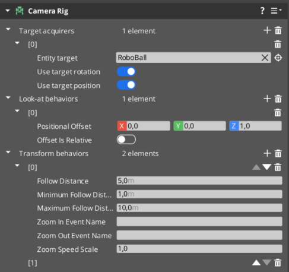

# RoboBall Tutorial 7

If you finished [RoboBall Tutorial 6](roboball_tutorial_6.md), you should have achieved this, which is a controllable ball that is a bit better.

However, let's improve it a bit more here. Using rotational impulse is not the best way to control the ball. Also, it's not possible for the camera rig to follow the ball nicely, so we will improve that here as well.

## Rotation Instead of Impulse

We could try to add a constant rotation to the entity, but the physics component would need to be disabled (but there is a script for it if interested).

Open up `roboball_control.lua` in the Lua editor again.

Add another property called `RotationDirection` and `AngularVelocity` that are floats:

```lua
local Control = {
	Properties = {
		ImpulseSize = 1.0,
		InputEventName = "",
		RotationDirection = 0.0,
		AngularVelocity = 0.2
	}
}
```

And in `OnPressed()`, assign the returned value of those keybindings to that property, and comment out the linear impulse and the local variable assigning:

```lua
function Control:OnPressed(value)
	--local ImpulseDirection = value * self.Properties.ImpulseSize
	-- RigidBodyRequestBus.Event.ApplyAngularImpulse(self.entityId, Vector3(0.0, 0.0, ImpulseDirection));
	self.Properties.RotationDirection = value
end
```

Then in `OnTick()`, add a `SetAngularVelocity` in the RigidBodyRequestBus:

```lua
	local RotVel = self.Properties.RotationDirection * self.Properties.AngularVelocity;
	RigidBodyRequestBus.Event.SetAngularVelocity(self.entityId, Vector3(0.0, 0.0, RotVel));
```

Play the game and press the keys.

You see that the ball keeps rotating. So let's null it after applying it again so it resets:

```lua
self.Properties.RotationDirection = 0.0
```

Play the game again. Now you notice for sure that it only rotates once when pressed. We need to change the function for the keybindings event from `OnPressed()` to `OnHeld()`:

```lua
function Control:OnHeld(value)
	self.Properties.RotationDirection = value
end
```

The total code should look like this:

```lua
local Control = {
	Properties = {
		ImpulseSize = 1.0,
		InputEventName = "",
		RotationDirection = 0.0,
		AngularVelocity = 0.2
	}
}

function Control:OnActivate()
	self.TickNotificationBus = TickBus.Connect(self);
	local inputBusId = InputEventNotificationId(self.Properties.InputEventName)
	self.InputNotificationBus = InputEventNotificationBus.Connect(self, inputBusId)
end

function Control:OnTick(deltaTime, currentTime)
	local Rot = TransformBus.Event.GetWorldRotation(self.entityId); 
 	local ImpulseSize = self.Properties.ImpulseSize
 	local x_new = ImpulseSize * math.cos(Rot.z)
 	local y_new = ImpulseSize * math.sin(Rot.z)
	RigidBodyRequestBus.Event.ApplyLinearImpulse(self.entityId, Vector3(x_new, y_new, 0.0));
	
	local RotVel = self.Properties.RotationDirection * self.Properties.AngularVelocity;
	RigidBodyRequestBus.Event.SetAngularVelocity(self.entityId, Vector3(0.0, 0.0, RotVel));
	self.Properties.RotationDirection = 0.0
end

function Control:OnHeld(value)
	--local ImpulseDirection = value * self.Properties.ImpulseSize
	self.Properties.RotationDirection = value
	-- RigidBodyRequestBus.Event.ApplyAngularImpulse(self.entityId, Vector3(0.0, 0.0, ImpulseDirection));
end

function Control:OnDeactivate()
	self.TickNotificationBus:Disconnect();
	self.InputNotificationBus:Disconnect();
end

return Control
```

And the ball control should look like this:



## Improve the Camera Rig

So you probably noticed that when you rotate the ball, the camera doesn't rotate around it. That is something that we gamers are not really used to, so let's change that.

Let's first reposition the camera to a new transform:

* Translate: `-5, 0, 2`
* Rotate: `0, 0, -90`



Get a quick view through the editor camera to check if the position is okay.

Then remove the transform behavior element called `FollowTargetFromAngle`.

Then add a `FollowTargetFromDistance` instead with the following:

* Follow Distance: `5 m`
* Minimum Follow Distance: `1`
* Maximum Follow Distance: `10`

Play the game and see the difference. It still follows it, but when you rotate it seems to not face the entity. 

Let's add the `FaceTarget` element at Target Behaviors.

Play again and you see that things have very much improved.

Now add a **Look At** behavior to be a little above the ball, namely `1.0` meters in the Z-axis.

This is the full component configuration:



So if you now press play, you should see the camera rotating around the ball. You still get a bit dizzy, but at least you know where the ball is going! :)

It might be nice to decouple the Z-axis from the ball, but that would require some more scripting, so let's leave that for another time. 


Yay! Time to go to [Part 8](roboball_tutorial_8.md)!