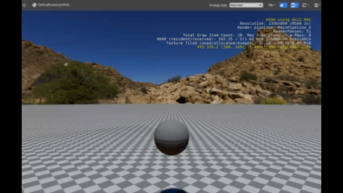

# Roboball 8

So if you finished section 7 you should be able to see this:




Now let's work with collisions!

The ball is bouncing around and could be hitting things but it is not doing anything to it. So let's work with that.

In the Roboball_control.lua add a collision event to OnActivate()

```lua
     local event = SimulatedBody.GetOnCollisionBeginEvent(self.entityId);
```
If you run this, you will see an error that there is a nil variable on that event. This is due that the event is being accessed when the physics hasn't been enabled yet, so we've got to use onPhysicsEnabled().

There is an issue open for that: https://github.com/o3de/o3de/issues/17630


Remove that last line and make this function:

```lua
function Control:OnPhysicsEnabled(entityId)
	local event = SimulatedBody.GetOnCollisionBeginEvent(self.entityId);
	self.CollisionEvent = event:Connect(
		function(_, collision)
			self:OnCollisionBegin(collision)
		end
	);
end
```

Running now will give an issuse that OnCollisionBegin doesn't exist, so let's add that function:

```lua
function Control:OnCollisionBegin(collision)
	Debug.Log('Ouch!')
end
```

And let's disconnect of the rigidbodynoticiation bus in OnDeactivate()

```lua
	self.RigidBodyNotificationBusHandler:Disconnect()
```

The full script should look like this now:

```lua
local Control = {
	Properties = {
		ImpulseSize = 1.0,
		InputEventName = "",
		RotationDirection = 0.0,
		AngularVelocity = 0.2
	}
}

function Control:OnActivate()
	self.TickNotificationBus = TickBus.Connect(self);
	local inputBusId = InputEventNotificationId(self.Properties.InputEventName)
	self.InputNotificationBus = InputEventNotificationBus.Connect(self, inputBusId)
	self.RigidBodyNotificationBusHandler = RigidBodyNotificationBus.Connect(self, self.entityId)

end

function Control:OnPhysicsEnabled(entityId)
	local event = SimulatedBody.GetOnCollisionBeginEvent(self.entityId);
	self.CollisionEvent = event:Connect(
		function(_, collision)
			self:OnCollisionBegin(collision)
		end
	);
end

function Control:OnCollisionBegin(collision)
	Debug.Log('Ouch!')
end

function Control:OnTick(deltaTime, currentTime)
	local Rot = TransformBus.Event.GetWorldRotation(self.entityId); 
	local ImpulseSize = self.Properties.ImpulseSize
	local x_new = ImpulseSize * math.cos(Rot.z)
	local y_new = ImpulseSize * math.sin(Rot.z)
	RigidBodyRequestBus.Event.ApplyLinearImpulse (self.entityId, Vector3(x_new,y_new, 0.0));
	
	local RotVel = self.Properties.RotationDirection * self.Properties.AngularVelocity;
	RigidBodyRequestBus.Event.SetAngularVelocity (self.entityId, Vector3(0.0, 0.0, RotVel));
	self.Properties.RotationDirection = 0.0

end

function Control:OnHeld(value)
	self.Properties.RotationDirection = value
 end


function Control:OnDeactivate()
	self.TickNotificationBus:Disconnect();
	self.InputNotificationBus:Disconnect();
	self.RigidBodyNotificationBusHandler:Disconnect()
end

return Control
```

Run the game and you should see the folllowing in the console:
```
(Script) - Ouch!
(Script) - Ouch!
(Script) - Ouch!
(Script) - Ouch!
```

## Differiate between collisions

Poor ball! But bouncing is what it does so it should at least know when it's hitting the floor at least!

Add this to properties:
```lua
		GroundId = EntityId(),
```

And replace the oncollision debug (ouch!) to this:
```lua
	-- Debug.Log('Ouch!')
	if tostring(collision:GetBody2EntityId()) == self.Properties.GroundId then
		Debug.Log(' Floor')
	end
```

Play the game again!

Nothing is happening and this is a bug! Let's have a quick fix assuming that the first thing it will hit is the floor.


Add the following to OnActivate()
```lua
	self.first_run = false
```

and the following above the entity comparison in OnCollision
```lua
	if self.first_run==false then
		self.Properties.GroundId = collision:GetBody2EntityId()
		self.first_run = true
	end
```

Now play the game again, you should see the following:

```lua
(Script) -  Floor
(Script) -  Floor
(Script) -  Floor
(Script) -  Floor
```


