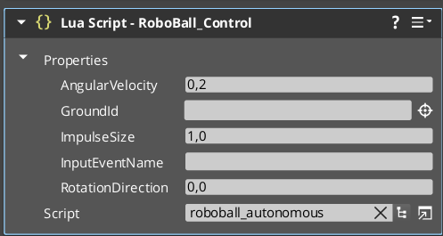
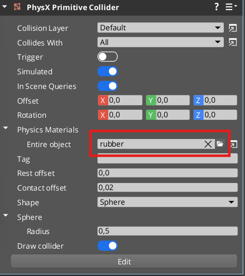
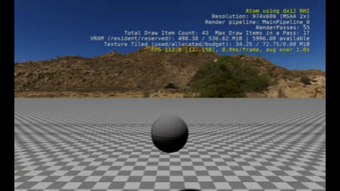
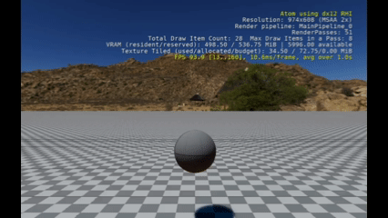

# RoboBall Tutorial 9

In the previous tutorial, you were able to make the ball more aware of what it is hitting. It looked like this and kept yelling "Floor! Floor!"


So let's now try to make something more useful with that information! Remember that the ball is mostly bouncing because of a bouncy material? That is quite unrealistic in terms of physics... How about we simulate some sort of motor that will give an upward bounce every time it hits the floor?

## Script an Autonomous Bounce

Copy `roboball_control.lua` and call it `roboball_autonomous.lua`, then change the script for the RoboBall to it.



Change all instances of `Control` to `Autonomous` within the script.

Now add the following line to the part where it collides with the ground (replace `Debug.Log(' Floor')`):

```lua
RigidBodyRequestBus.Event.ApplyLinearImpulse(self.entityId, Vector3(0, 0, 1.0));
```

And comment out the `RigidBodyRequestBus.Event.ApplyLinearImpulse()` and `SetAngularVelocity()` in the `OnTick()` function.

And change the material back to `Rubber.physxmaterial` (remember that you can find that asset under `25.05/Gems/PhysX/Common/Assets/PhysX`).



Play the game and see what happens!



It's a very small bounce... almost like there hasn't really been any bounce at all.

## Add Some Control to That Bounce

We can make it a more controlled impulse so that the height of the bounce will stay more even.

Replace this line:

```lua
		RigidBodyRequestBus.Event.ApplyLinearImpulse(self.entityId, Vector3(0, 0, 1.0));
```

With this:

```lua
		local velocity = RigidBodyRequestBus.Event.GetLinearVelocity(self.entityId);
		local mass = RigidBodyRequestBus.Event.GetMass(self.entityId);
		local BounceImpulse = mass * (6 - velocity.z)
		RigidBodyRequestBus.Event.ApplyLinearImpulse(self.entityId, Vector3(0, 0, BounceImpulse));
```

Now there should be a more even bounce.



So now the ball is able to bounce using upward impulses (like an actuator) instead of relying on an 'unrealistic' forever-bouncing material.

## Restore the Forward Impulse

This must look like a familiar sight! It would be nice if you could be able to see the ball go forward again.

Replace:

```lua
		RigidBodyRequestBus.Event.ApplyLinearImpulse(self.entityId, Vector3(0, 0, BounceImpulse));
```

With:

```lua
		local Rot = TransformBus.Event.GetWorldRotation(self.entityId); 
		local ImpulseSize = self.Properties.ImpulseSize
		local x_new = ImpulseSize * math.cos(Rot.z)
		local y_new = ImpulseSize * math.sin(Rot.z)
		RigidBodyRequestBus.Event.ApplyLinearImpulse(self.entityId, Vector3(x_new, y_new, BounceImpulse));
```

If you play the game now, you see that the camera rig needs to be adjusted. Turn the **Take Target's Rotation** off. 

Then you can follow the ball again, which should look like this:


## Fix the Rotation

Now we are not controlling the ball anymore with `OnTick()` (so every simulation frame). Let's try to control the heading of the robot ball in a different way.

Start a new global variable called `ControlHeading` in `OnActivate()`:

```lua
	self.ControlHeading = 0.0
```

Replace this line in `OnHeld()`:

```lua
	self.Properties.RotationDirection = value
```

With:

```lua
		self.ControlHeading = self.ControlHeading + value * self.Properties.AngularVelocity
		Debug.Log(tostring(self.ControlHeading))
```

And change the following in `OnCollisionBegin()`:

```lua
		local x_new = ImpulseSize * math.cos(Rot.z)
		local y_new = ImpulseSize * math.sin(Rot.z)
```

To:

```lua
		local x_new = ImpulseSize * math.cos(self.ControlHeading)
		local y_new = ImpulseSize * math.sin(self.ControlHeading)
```

Furthermore, change `OnHeld()` back to `OnPressed()` and add a wrap function to the script:

```lua
function WrapAngle(angle)
    return (angle + math.pi) % (2 * math.pi) - math.pi
end
```

And apply this to the control heading:

```lua
		self.ControlHeading = WrapAngle(self.ControlHeading + value * self.Properties.AngularVelocity)
```

## Control the Forward Speed and Clean Up the Code

It will go faster every time, so let's see if we can control that speed.

Add the following to `OnCollisionBegin()` to change the impulse size accordingly:

```lua
		local ForwardVelocity = velocity.x * math.cos(self.ControlHeading) + velocity.y * math.sin(self.ControlHeading);
		Debug.Log(tostring(ForwardVelocity))
		local ForwardImpulse = mass * (6 - ForwardVelocity)
		local ImpulseSize = ForwardImpulse
```

Now let's clean up the code since there is a lot of legacy stuff in there. It should look like this:

```lua
local Autonomous = {
	Properties = {
		ForwardRef = 6.0,
		BounceRef = 6.0,
		RotationDiff = 0.2,
		InputEventName = "Control",
		AngularVelocity = 0.2,
		GroundId = EntityId(),
	}
}

function WrapAngle(angle)
    return (angle + math.pi) % (2 * math.pi) - math.pi
end

function Autonomous:OnActivate()
	local inputBusId = InputEventNotificationId(self.Properties.InputEventName)
	self.InputNotificationBus = InputEventNotificationBus.Connect(self, inputBusId)
	self.RigidBodyNotificationBusHandler = RigidBodyNotificationBus.Connect(self, self.entityId)
	self.first_run = false
	self.ControlHeading = 0.0
end

function Autonomous:OnPhysicsEnabled(entityId)
	local event = SimulatedBody.GetOnCollisionBeginEvent(self.entityId);
	self.CollisionEvent = event:Connect(
		function(_, collision)
			self:OnCollisionBegin(collision)
		end
	);
end

function Autonomous:OnCollisionBegin(collision)
	if collision:GetBody2EntityId() == self.Properties.GroundId then
		local velocity = RigidBodyRequestBus.Event.GetLinearVelocity(self.entityId);
		local mass = RigidBodyRequestBus.Event.GetMass(self.entityId);
		local BounceImpulse = mass * (self.Properties.BounceRef - velocity.z)
		
		local ForwardVelocity = velocity.x * math.cos(self.ControlHeading) + velocity.y * math.sin(self.ControlHeading);
		local ForwardImpulse = mass * (self.Properties.ForwardRef - ForwardVelocity)
		local x_new = ForwardImpulse * math.cos(self.ControlHeading)
		local y_new = ForwardImpulse * math.sin(self.ControlHeading)
		RigidBodyRequestBus.Event.ApplyLinearImpulse(self.entityId, Vector3(x_new, y_new, BounceImpulse));
	end
end

function Autonomous:OnPressed(value)
	self.ControlHeading = WrapAngle(self.ControlHeading + value * self.Properties.AngularVelocity)
end

function Autonomous:OnDeactivate()
	self.InputNotificationBus:Disconnect();
	self.RigidBodyNotificationBusHandler:Disconnect()
end

return Autonomous
```

And with this all, it shows a familiar sight again, namely a controllable ball:


However, the important distinction is that the ball doesn't bounce relying on an unrealistic material but uses simulated actuators that only bounce when the floor is hit! 

Let's give the ball some more true autonomy with walls and more obstacles.

Go to the [final part](roboball_tutorial_10.md).